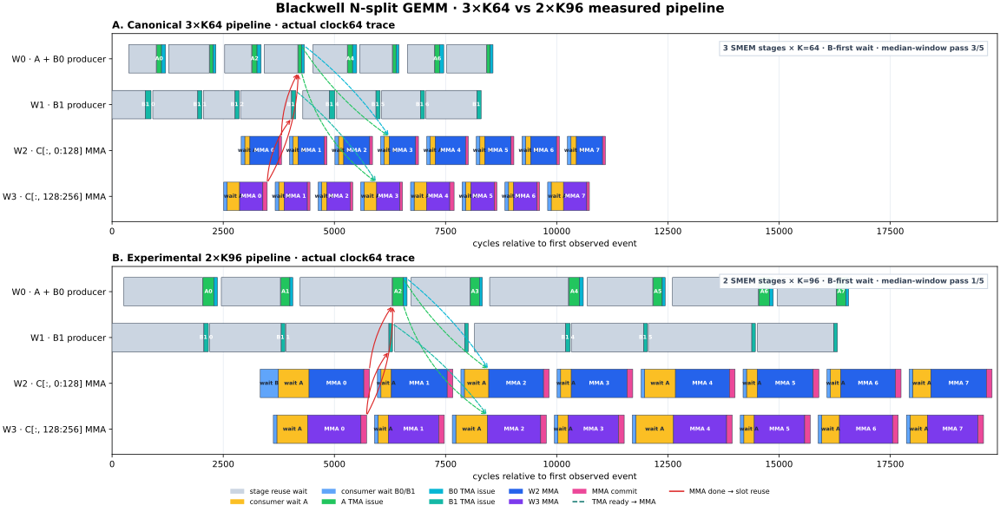

# 3×K64 vs 2×K96 actual pipeline trace

## Result

The panels use the same cycle axis. Each panel contains eight steady-state
pipeline iterations (`kt=56..63`), so the represented K work differs:

- 3×K64 kernel: `8 × 64 = 512` K elements
- 2×K96 kernel: `8 × 96 = 768` K elements

The gray regions are waits before overwriting a reused SMEM stage. Yellow and
blue are consumer waits, green/cyan are TMA issue instructions, and blue/purple
are the two MMA issue-warp intervals. Dashed arrows show TMA-ready dependencies;
red arrows show the dependency from the old MMA completion to reuse of the same
SMEM slot. A `tcgen05.commit` timestamp arms the completion barrier and is not
the exact asynchronous MMA completion cycle, so the red arrows are dependency
arrows rather than latency measurements.

## Selected-pass cycle summary

The pass whose full observed window was the median of five independent traces
was selected separately for each kernel.

| Metric | 3×K64, pass 3 | 2×K96, pass 1 |
|---|---:|---:|
| represented K work | 512 | 768 |
| full producer + consumer window | 11,094 cycles | 19,791 cycles |
| consumer window | 8,586 cycles | 16,459 cycles |
| consumer cycles per represented K | 16.77 | 21.43 |
| mean MMA interval, per warp and iteration | 564 cycles | 1,202 cycles |
| mean wait A, per warp and iteration | 158 cycles | 441 cycles |
| mean wait B, per warp and iteration | 80 cycles | 99 cycles |
| mean W0 stage-reuse wait per iteration | 738 cycles | 1,626 cycles |
| mean W1 stage-reuse wait per iteration | 891 cycles | 1,911 cycles |

For this traced window, K96 uses about **27.8% more consumer cycles per K**
than K64. The visible loss is not primarily the B wait: K96 has substantially
longer A waits and, with only two slots, much longer stage-reuse waits. Its MMA
interval also grows by more than the expected 1.5× work ratio. This agrees with
the uninstrumented benchmark, where K96 was slower than K64, but the trace
numbers themselves must not be interpreted as kernel TFLOP/s because clock
instrumentation changes scheduling and register use.

## Five-pass observed windows

| Pass | 3×K64 cycles | 2×K96 cycles |
|---:|---:|---:|
| 1 | 10,692 | **19,791** |
| 2 | 10,809 | 20,739 |
| 3 | **11,094** | 19,274 |
| 4 | 11,281 | 20,864 |
| 5 | 11,138 | 19,517 |

Bold values are the selected median-window passes.

## Conditions

- GPU: NVIDIA B200, Vast.ai instance `46382599`
- CUDA compiler: 12.9 (`sm_100a`)
- Matrix: BF16 `16384³`, random `[0,1)` input
- Kernel: persistent 148 CTA, static 8×16 M-fast scheduler, B-first consumer wait
- Run: one warmup and one measured launch for each trace; K64/K96 launch order
  alternated across five independent processes
- Trace target: block 0, persistent output-tile iteration 8, `kt=56..63`
- Correctness: both kernels bit-exact at `512³` with pattern input
- GPU after collection: 29 °C

The exact generated CUDA sources, compiler logs, validation logs, five raw CSV
files per kernel, and per-run stdout are retained in this directory.

The corresponding uninstrumented K96 experiment is documented in
[`NSPLIT_K96_2STAGE_EXPERIMENT.md`](../../5.GEMM/NSPLIT_K96_2STAGE_EXPERIMENT.md).
